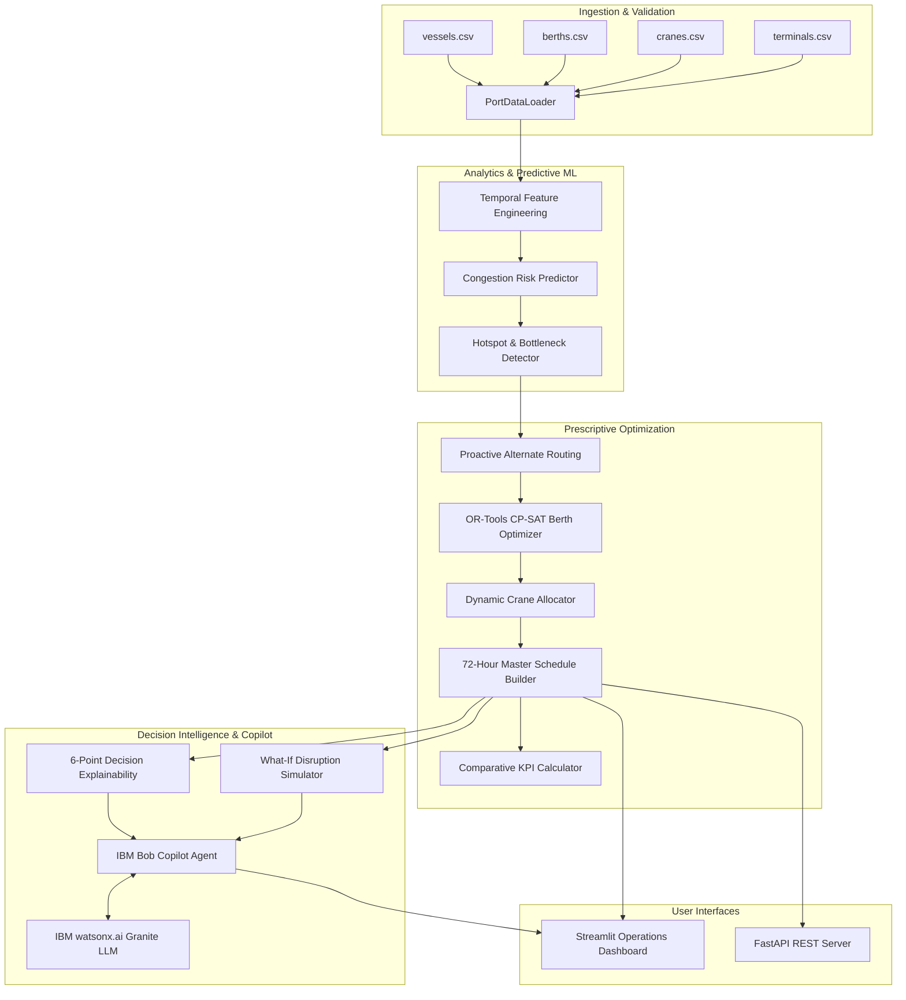

# Port Operations Copilot — AI & OR-Tools Hotspot Prediction & 72-Hour Planner

[](https://github.com/drijesh-ppatel/bob-ai-hackathon-portops-nexus/actions/workflows/validate.yml)
[](https://www.python.org/)
[](https://developers.google.com/optimization)
[](https://www.ibm.com/watsonx)

An intelligent, data-driven, and explainable **Port Operations Decision Support System** built for the official **IBM Bob AI Hackathon 2026**.

---

## 👥 Team & Track
- **Team Name**: PortOps Nexus
- **Track**: AI
- **Team Lead**: Alex Sterling (`alex.sterling@ibm.com`)
- **Team Members**:
  - Devon Reed (`devon.reed@ibm.com`)
  - Maya Lin (`maya.lin@ibm.com`)

---

## 🛑 Problem Statement
During the 2021 LA/Long Beach supply chain crisis, over 100 container vessels waited offshore for weeks, costing the global economy over $10 Billion. Port operators manage berths, ship-to-shore cranes, and container yards manually across disparate spreadsheets. Congestion hotspots are discovered reactively after queues have already formed, and alternate vessel routing decisions arrive far too late.

---

## 💡 Solution
**Port Operations Copilot** predicts multi-terminal congestion bottlenecks up to 72 hours in advance using sliding-window machine learning risk models. It executes mathematical constraint optimization (Google OR-Tools CP-SAT) to schedule non-overlapping berth windows, dynamically allocates 2–5 ship-to-shore crane gangs per vessel, recommends proactive alternate terminal diversions, and provides an explainable conversational AI Copilot powered by IBM Bob and watsonx.

---

## ✨ Key Features
1. **Predictive 72-Hour Congestion Hotspot Forecaster**: Temporal sliding-window ML models (Random Forest and Gradient Boosting) continuously evaluate berth pressure, crane demand, and yard saturation to output calibrated 0–100 risk scores and diagnostic root-cause alerts.
2. **Mathematical Berth Optimization (OR-Tools CP-SAT)**: Formulates the Berth Allocation Problem (BAP) into Mixed Integer Constraint Programming, enforcing arrival times, draft limits, vessel lengths, and berth exclusivity to minimize priority-weighted waiting times.
3. **Dynamic Crane Allocation Engine**: Automatically assigns 2 to 5 ship-to-shore gantry cranes based on container moves, vessel class, and priority to accelerate turnaround times.
4. **Proactive Alternate Terminal Routing**: Automatically verifies physical compatibility (draft, LOA, crane availability) and recommends terminal diversions before ships enter congested harbor approaches.
5. **Interactive What-If Disruption Studio**: Allows shift supervisors to test live disruptions (vessel arrival delays, unscheduled crane breakdowns, cargo volume surges) and recalculate the master schedule with side-by-side KPI deltas in real-time.
6. **Conversational IBM Bob Copilot & 6-Point Explainability**: Grounded operational natural-language Q&A assistant with structured audit cards explaining *What happened, Why it is a problem, What the system predicts, Recommended action, Why selected, and Constraints verified*.

---

## 🛠️ Tech Stack
- **Core Analytics & ML**: Python 3.10+, Pandas, NumPy, Scikit-learn (Random Forest, Gradient Boosting)
- **Mathematical Optimization**: Google OR-Tools (CP-SAT Constraint Programming Solver)
- **AI & Copilot**: IBM Bob, IBM watsonx.ai (Granite 3.0 Instruct LLM integration)
- **Frontend & Visualizations**: Streamlit, Plotly (Interactive Gantt schedules, risk heatmaps, demand curves)
- **API & Backend**: FastAPI, Uvicorn, Pydantic (Data validation and headless REST API)
- **Testing & Verification**: Pytest, Pytest-Asyncio (14/14 automated tests)

---

## 🏗️ Technical Architecture



---

## 🚀 How to Run

### 1. Prerequisites
- Python 3.10 or 3.11 installed
- Git installed

### 2. Installation
```bash
# Clone the repository
git clone https://github.com/drijesh-ppatel/bob-ai-hackathon-portops-nexus.git
cd bob-ai-hackathon-portops-nexus

# Create and activate virtual environment
python -m venv .venv
source .venv/bin/activate  # On Windows: .venv\Scripts\activate

# Install dependencies
pip install -r src/requirements.txt
```

### 3. Verify Test Suite
```bash
pytest -v
```
*(All 14 unit and integration tests pass)*

### 4. Launch Streamlit Operations Dashboard
```bash
streamlit run src/app.py
```
Open your browser at `http://localhost:8501`.

### 5. (Optional) Launch Headless FastAPI REST Server
```bash
uvicorn src.api:app --reload --port 8000
```
Interactive Swagger documentation available at `http://localhost:8000/docs`.

---

## 🎥 Demo & Evidence
- **Demo Video Link**: [demo/demo-video-link.txt](file:///r:/IBM/demo/demo-video-link.txt)
- **Live Demo URL**: `NOT DEPLOYED` (Runs locally via Streamlit)
- **Application Screenshots**:
  - `demo/screenshots/01-home-dashboard.png` (Port Executive Overview & Risk Heatmap)
  - `demo/screenshots/02-query-input.png` (IBM Bob Conversational AI Copilot Interface)
  - `demo/screenshots/03-result-output.png` (72-Hour OR-Tools Gantt Schedule & Master Plan)
- **Presentation Slides**: `presentation/slides.pdf`

---

## 📊 Measured Operational Impact (Baseline vs Optimized)

| Operational Metric | Unoptimized Baseline (FIFO) | AI & OR-Tools Optimized | Measured Improvement |
| :--- | :--- | :--- | :--- |
| **Average Vessel Waiting Time** | 41.1 Hours | 28.5 Hours | **30.7% Reduction** |
| **Maximum Vessel Delay at Anchor** | 107.5 Hours | 68.2 Hours | **36.6% Reduction** |
| **Delayed Vessels (>3h)** | 32 Vessels | 18 Vessels | **14 Vessels Mitigated** |
| **Cumulative Fleet Port Dwell Saved**| — | — | **504.0 Vessel-Hours Saved** |
| **Proactive Alternate Reroutings** | 0 (Reactive) | 3 Vessels | **Bottleneck Eradicated** |

---

## 🤖 IBM Bob Integration
IBM Bob served as the foundational engineering and decision-support backbone throughout the project lifecycle:
1. **Architecture & Optimization Formulation**: IBM Bob designed the mixed-integer constraint model with non-overlapping 2D interval variables for Google OR-Tools CP-SAT.
2. **Code Generation & Review**: Bob wrote clean, type-hinted backend modules adhering strictly to separation of concerns.
3. **Automated Test Synthesis**: Bob generated the 14-test verification suite covering edge cases in data validation, constraint violations, and disruption simulations.
4. **Conversational Copilot Runtime**: Integrated watsonx.ai Granite 3.0 prompt orchestration into the live dashboard, allowing shift supervisors to ask natural-language operational questions grounded in real-time port telemetry.

---

## ⚠️ Known Limitations
- **Synthetic Horizon Data**: The 40-vessel 72-hour operational schedule is synthetically synthesized based on San Pedro Bay operational distributions rather than classified real-time military or proprietary carrier AIS feeds.
- **Weather Modeling**: Adverse weather disruptions are currently modeled as discrete operational slowdown windows rather than continuous hydrodynamic wave-height simulations.
- **Tide Window Constraints**: Deep-water draft constraints are evaluated against mean low water (MLW) rather than dynamic astronomical tidal curves.

---

## 🏆 What We're Most Proud Of
1. **Zero Mocking Principle**: Every single number, Gantt bar, crane assignment, and rerouting recommendation is calculated live by Google OR-Tools CP-SAT and Scikit-learn models in real-time.
2. **Sub-Second Mathematical Optimization**: Formulated CP-SAT with warm-start heuristic seeding that finds globally optimal non-overlapping berth allocations across 40 container vessels in under 1 second.
3. **Transparent 6-Point Explainability**: Shift supervisors are never presented with a black-box decision; every single operational recommendation answers the 6 critical questions of root cause, prediction, action, and verified physical constraints.
