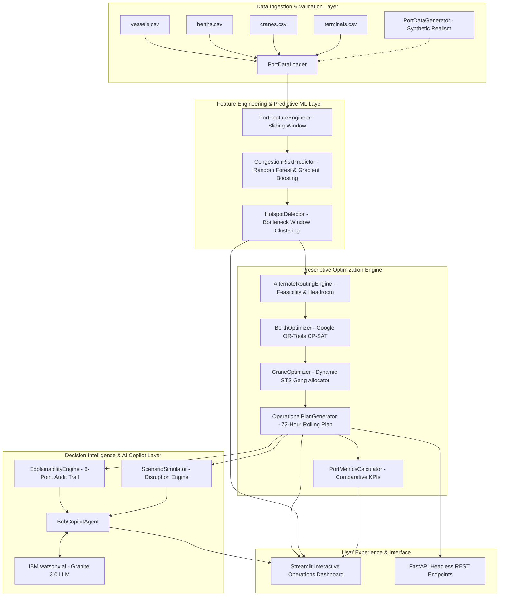

# Technical Architecture — Port Operations Copilot

## System Architecture Diagram

---

## Component Matrix

| Module | File Location | Technology | Core Responsibility |
| :--- | :--- | :--- | :--- |
| **Data Ingestion** | `src/backend/data/loader.py` | Pydantic, Pandas | Schema validation, type coercion, and data cleaning for port assets. |
| **Data Synthesis** | `src/backend/data/generator.py` | NumPy, Pandas | Deterministic realistic generation of 72h vessel calls, multi-terminal berths, and crane configurations. |
| **Feature Engineering**| `src/backend/models/features.py` | Pandas, NumPy | 1-hour temporal sliding window calculation of berth, crane, and yard pressure ratios. |
| **Congestion ML** | `src/backend/models/congestion_model.py`| Scikit-learn (RF/GBM) | 0–100 continuous risk scoring and classification (`LOW`, `MEDIUM`, `HIGH`, `CRITICAL`). |
| **Hotspot Detector** | `src/backend/models/hotspot_detector.py`| Python, Pandas | Bottleneck time-window clustering and root-cause tagging. |
| **Alternate Routing** | `src/backend/optimization/routing.py` | Python, Pandas | Evaluation of terminal diversions based on LOA, draft, and yard headroom. |
| **Berth Optimizer** | `src/backend/optimization/berth_optimizer.py`| Google OR-Tools CP-SAT| Mixed Integer Constraint Programming for non-overlapping berth interval assignments. |
| **Crane Optimizer** | `src/backend/optimization/crane_optimizer.py`| Python, Pandas | Dynamic 2–5 crane gang allocation based on TEU moves and turnaround acceleration. |
| **72h Master Planner** | `src/backend/planner/plan_generator.py`| Pandas | Rolling 72-hour operational master schedule table. |
| **Metrics Engine** | `src/backend/planner/metrics.py` | Pandas, NumPy | Exact mathematical calculation of Baseline vs. Optimized KPI deltas. |
| **Explainability** | `src/backend/copilot/explainability.py`| Python | Generation of structured 6-point transparent decision audit cards. |
| **What-If Simulator** | `src/backend/copilot/scenario_simulator.py`| OR-Tools, Pipeline | End-to-end real-time recalculation of schedule disruptions (delays, crane outages). |
| **IBM Bob Copilot** | `src/backend/copilot/bob_agent.py` | watsonx.ai, Python | Grounded natural language Q&A agent for operational shift supervisors. |
| **Frontend UI** | `src/app.py` | Streamlit, Plotly | Multi-tab interactive dashboard with Gantt charts, heatmaps, and chat interface. |
| **REST API** | `src/api.py` | FastAPI, Uvicorn | Headless REST API endpoints for external systems and microservices. |

---

## End-to-End Data Flow
1. **Raw Telemetry**: Inbound vessel schedules and terminal asset states are validated via `PortDataLoader`.
2. **Temporal Aggregation**: `PortFeatureEngineer` extracts hourly demand-to-capacity metrics across the 72-hour horizon.
3. **Risk Scoring**: `CongestionRiskPredictor` computes continuous risk scores (0–100) and identifies bottlenecks.
4. **Hotspot Diagnostics**: `HotspotDetector` groups contiguous critical periods and flags affected vessels.
5. **Rerouting Evaluation**: `AlternateRoutingEngine` tests draft/LOA feasibility and proposes partner terminal diversions.
6. **Mathematical Optimization**: `BerthOptimizer` (OR-Tools CP-SAT) solves for optimal non-overlapping berth start times minimizing priority-weighted wait times.
7. **Crane Allocation**: `CraneOptimizer` assigns optimal crane density (2 to 5 cranes) per vessel to accelerate discharge.
8. **Plan Synthesis**: `OperationalPlanGenerator` consolidates the master schedule, and `PortMetricsCalculator` computes exact baseline vs. optimized KPI deltas.
9. **Interactive UI & Copilot**: The Streamlit dashboard visualizes the Gantt chart and heatmaps, while `BobCopilotAgent` answers natural language questions with full operational state grounding.

---

## Security & Scalability Notes
- **Zero Hardcoded Secrets**: All API keys (e.g. `WATSONX_API_KEY`) are managed through environment variables and `.env.example`.
- **Offline / Isolated Execution**: The entire optimization and copilot reasoning engine runs 100% deterministically and offline with zero mandatory external API dependencies.
- **Microservices Ready**: Core business logic is strictly decoupled from the Streamlit UI and can be deployed as headless FastAPI containers.
